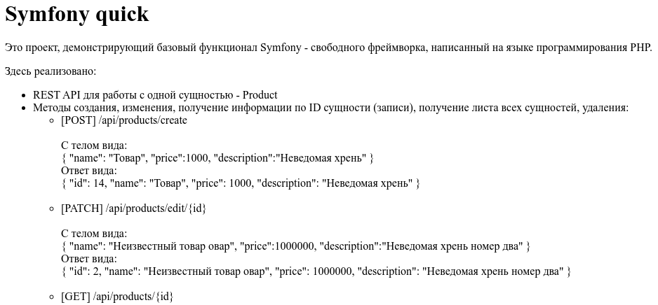

# Symfony quick

Это проект, демонстрирующий базовый функционал Symfony — свободного фреймворка, написанного на языке программирования PHP.

Здесь реализовано:

* **REST API** для работы с одной сущностью — `Product`

  * Методы создания, изменения, получения информации по ID сущности (записи), получения списка всех сущностей и удаления:

      * **\[POST]** `/api/products/create`
        С телом вида:

        ```json
        {
          "name": "Товар",
          "price": 1000,
          "description": "Неведомая хрень"
        }
        ```

        Ответ вида:

        ```json
        {
          "id": 14,
          "name": "Товар",
          "price": 1000,
          "description": "Неведомая хрень"
        }
        ```

        **Пример curl:**

        ```bash
        curl -X POST http://localhost:8000/api/products/create \
          -H "Content-Type: application/json" \
          -d '{"name":"Товар", "price":1000, "description":"Неведомая хрень"}'
        ```

      * **\[PATCH]** `/api/products/edit/{id}`
        С телом вида:

        ```json
        {
          "name": "Неизвестный товар овар",
          "price": 1000000,
          "description": "Неведомая хрень номер два"
        }
        ```

        Ответ вида:

        ```json
        {
          "id": 2,
          "name": "Неизвестный товар овар",
          "price": 1000000,
          "description": "Неведомая хрень номер два"
        }
        ```

        **Пример curl:**

        ```bash
        curl -X PATCH http://localhost:8000/api/products/edit/2 \
          -H "Content-Type: application/json" \
          -d '{"name":"Неизвестный товар овар", "price":1000000, "description":"Неведомая хрень номер два"}'
        ```

      * **\[GET]** `/api/products/{id}`
        Ответ вида:

        ```json
        {
          "id": 2,
          "name": "Неизвестный товар овар",
          "price": 1000000,
          "description": "Неведомая хрень номер два"
        }
        ```

        **Пример curl:**

        ```bash
        curl http://localhost:8000/api/products/2
        ```

      * **\[GET]** `/api/products`
        Ответ вида:

        ```json
        {
          "meta": {
            "count": 2
           },
           "data": [
           {
             "id": 5,
             "name": "Keyboard",
             "price": 1999,
             "description": "Ergonomic and stylish!"
           },
           {
             "id": 6,
             "name": "Товар",
             "price": 1000,
             "description": "Неведомая хрень"
           }
           ]
         }
        ```

        **Пример curl:**

        ```bash
        curl http://localhost:8000/api/products
        ```

      * **\[DELETE]** `/api/products/delete/{id}`
        Ответ вида:

        ```json
        {
          "success": true
        }
        ```

        **Пример curl:**

        ```bash
        curl -X DELETE http://localhost:8000/api/products/delete/2
        ```
    * **\[GET]** `/about`
    
    Ответ - html страница
      
    

* Работа с БД PostgreSQL
* Обработка исключительных ситуаций
* Валидация полей объекта
* Журналирование

---

## Для работы приложения необходимо:

* `"php": ">=8.1"`
* Пустая БД PostgreSQL с параметрами как в [.env](.env)
  (в нашем случае:

  ```
  simfony:simfony@127.0.0.1:5432/simfony?serverVersion=16&charset=utf8
  ```

  )
* Web server (для разработки и проверки работоспособности достаточно команды):

  ```
  symfony server:start
  ```

---

## Запуск:

1. Перед запуском приложения выполнить миграции:

   ```bash
   ./bin/console doctrine:migrations:migrate
   ```

2. Непосредственно запуск:

   ```bash
   symfony server:start
   ```
предварительно нужно прописать переменную среды
```bash
  export PATH="$HOME/.symfony5/bin:$PATH"
```